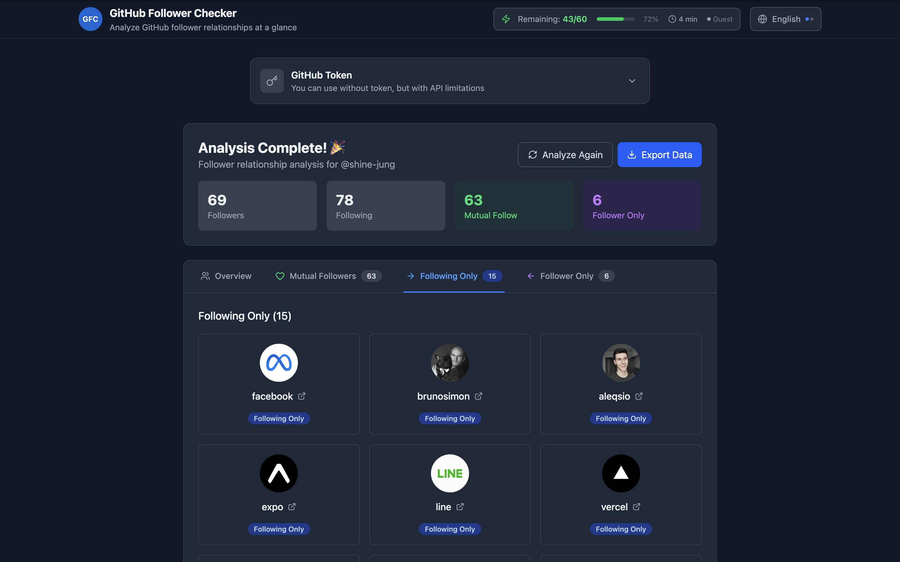

# GitHub Follower Checker

🇺🇸 English | [🇰🇷 한국어](README.ko.md)

> 🔍 Analyze your GitHub follower relationships at a glance

Ever wondered who follows you and whom you follow? Check if it's mutual or one-way relationships all in one place!

## 🖼️ Screenshot



## ✨ What you can do

- 👤 **Just enter a GitHub username** - Search for any user you want to analyze
- 📊 **Clean relationship categorization** - We organize relationships into three types:
  - **Mutual Follow**: You both follow each other 🤝
  - **Following Only**: You follow them but they don't follow you back ➡️
  - **Follower Only**: They follow you but you don't follow them back ⬅️
- 🔐 **Works without a token!** - But with a token, you can analyze much more
- 🌐 **Multi-language support** - Available in Korean and English
- 💾 **Export your analysis results** - Download as JSON files
- ⚡ **Real-time API usage tracking** - See how many requests you have left
- 🔄 **Remember your analysis** - Previous results are saved for future visits

## 🚀 Getting Started (For Developers)

### Requirements

- Node.js 18.0 or higher
- pnpm or npm
- GitHub token is optional

### Installation

```bash
# Install dependencies
pnpm install

# Start development server
pnpm dev

# Build for production
pnpm build

# Preview production build
pnpm preview
```

### Creating a GitHub Token (For more analysis)

1. GitHub → Settings → Developer settings → Personal access tokens → Tokens (classic)
2. Click "Generate new token"
3. Select these permissions:
   - `read:user` - To read user information
   - `user:follow` - To read follower/following information
4. Enter the generated token in the app

## 🛠️ Tech Stack

- **Frontend**: React 19 + TypeScript
- **Build Tool**: Vite 7
- **Styling**: Tailwind CSS 4
- **Icons**: Lucide React
- **Date Handling**: date-fns
- **Linting**: ESLint 9

## 📱 How to Use

1. **Enter Token (Optional)**: If you have a GitHub token, enter it for more analysis
2. **Search User**: Enter the GitHub username you want to analyze
3. **Start Analysis**: Just click "Start Analysis" and it begins automatically
4. **View Results**: Results are neatly organized into three relationship types
5. **Export Data**: Download as JSON file if you like the results

## 🔒 Your Privacy is Safe

- All data is stored only in your browser (not sent to any server)
- Your personal information never leaves your device
- GitHub tokens are safely stored and never leaked externally
- You can delete tokens and data anytime

## 📄 License

Feel free to use under MIT License!

## 🤝 Let's Build Together

If you have ideas for improvements or found bugs, please let us know! Issues and pull requests are all welcome.

## 📞 Contact

- Bug reports & improvements: [GitHub Issues](https://github.com/shine-jung/github-follower/issues)
- Full source code: [GitHub Repository](https://github.com/shine-jung/github-follower)

---

**Made with ❤️ for GitHub community**
